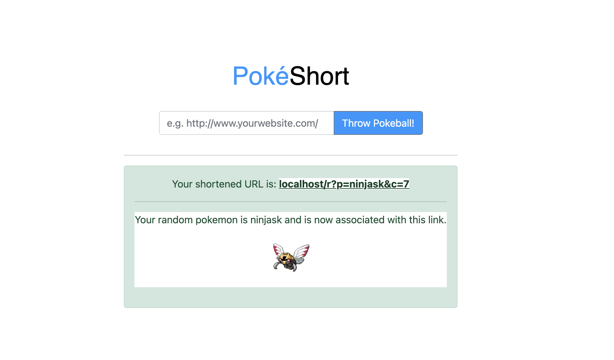

# PokeShort
This URL shortener uses the PokeAPI to request a random pokemon from all known pokemon.  After selecting a pokemon, the PHP script generates a shortened URL with the pokemon being one of the keys in the database.  An image of the pokemon is displayed.  



##
Does NOT currently use any wrappers. Purely PHP with a single request per URL generation to the [PokeAPI](https://pokeapi.co/)

```php
$url = "https://pokeapi.co/api/v2/pokemon/";
```

### ToDo
* Add landing page when using shortened URL -> On landing page, display pokemon and some flavor text about the pokemon for approx 5 seconds
* Remove unused wrappers
* Fix CSS on Alert box
